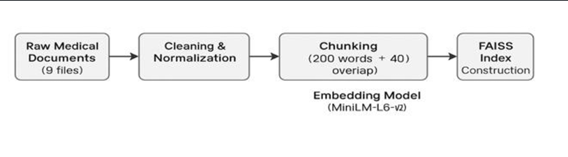
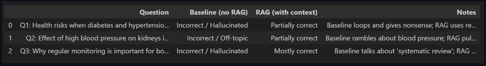
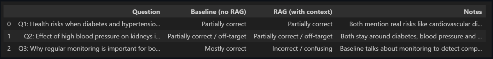
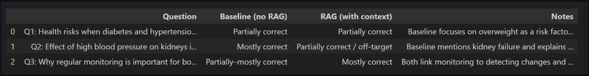
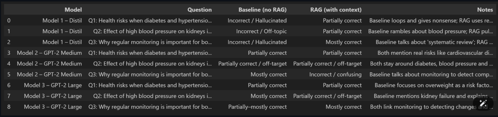

# 🩺 Chronic Care RAG: Diabetes & Hypertension Question Answering

A **Retrieval-Augmented Generation (RAG)** system for answering clinical questions related to **Diabetes** and **Hypertension**, using **MiniLM embeddings**, **FAISS retrieval**, and **GPT-2 family language models**.

This project evaluates how retrieval-based grounding improves answer **correctness**, **groundedness**, and **hallucination reduction** across different model sizes.

---

## 1. System Overview

This project implements a **lightweight medical question-answering system** using the RAG paradigm.

The system compares **baseline generation** versus **RAG-enhanced generation** across three GPT-2 family models to analyze:
- Factual accuracy  
- Context grounding  
- Hallucination behavior  

---

## 2. Architecture

### RAG System Workflow

**Workflow**
1. User submits a medical question  
2. Query is embedded using **MiniLM-L6-v2**  
3. Relevant document chunks are retrieved using **FAISS**  
4. Retrieved context is appended to the prompt  
5. GPT-2 model generates a grounded response  

---

## 3. Dataset & Corpus Processing

**Corpus Composition**
- Diabetes  
- Hypertension  
- Common / Overlapping conditions  

**Preprocessing Pipeline**
- Text cleaning & normalization  
- Chunking into **200-word windows** (40-word overlap)  
- Embedding using **MiniLM-L6-v2**  
- FAISS index construction  

---

## 4. Retrieval Example

The figure above shows:
- A sample medical question  
- Top-k retrieved chunks from the FAISS index  
- How retrieval improves contextual grounding  

---

## 5. Baseline vs RAG Comparison

| Setting | Behavior |
|------|---------|
| **Baseline** | Hallucinations, vague answers |
| **RAG Enabled** | Improved grounding and accuracy |

---

## 6. Model Evaluations

### 6.1 DistilGPT-2

- Struggles under baseline conditions  
- Hallucinates frequently  
- RAG improves relevance but depth remains limited  

---

### 6.2 GPT-2 Medium

- Better fluency and correctness  
- RAG stabilizes output  
- Reduced off-target responses  

---

### 6.3 GPT-2 Large

- Best overall performance  
- RAG improves grounding  
- Still limited clinical reasoning  

---

## 6.4 Combined Evaluation

**Summary**
- RAG improves correctness across all models  
- Larger models benefit more from retrieval  
- Smaller models rely heavily on RAG  

---

## 7. Key Insights

- ✅ RAG improves factual grounding  
- 📈 Larger models perform more consistently  
- ⚠️ Smaller models hallucinate without retrieval  
- 🏥 Medical QA still needs domain-specific LLMs  

---

## 8. Conclusion

This project demonstrates how **Retrieval-Augmented Generation (RAG)** significantly improves medical QA reliability for **Diabetes & Hypertension**.

By grounding responses in curated medical documents:
- Hallucinations are reduced  
- Context relevance improves  
- Lightweight models become more usable  

---

## 📌 Technologies Used

- Python  
- Hugging Face Transformers  
- MiniLM-L6-v2  
- FAISS  
- GPT-2 Family Models  

---

## 🚀 Future Work

- Medical-domain LLM integration  
- Clinical guideline alignment (ADA, AHA)  
- Explainable retrieval visualization  
- Larger evaluation benchmarks  
